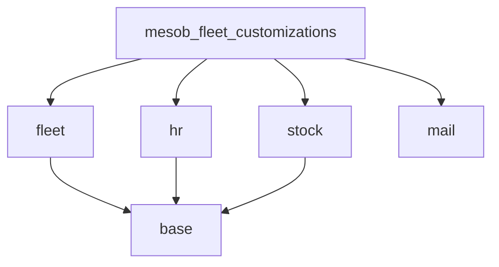
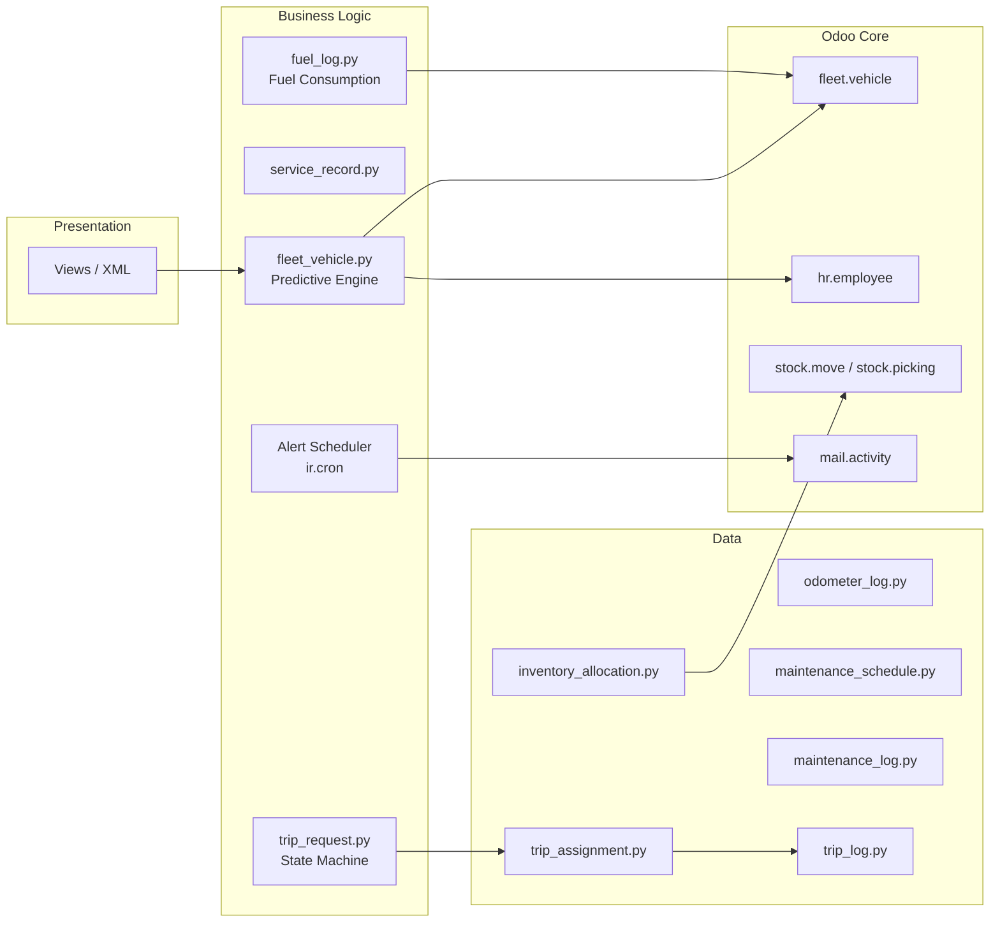
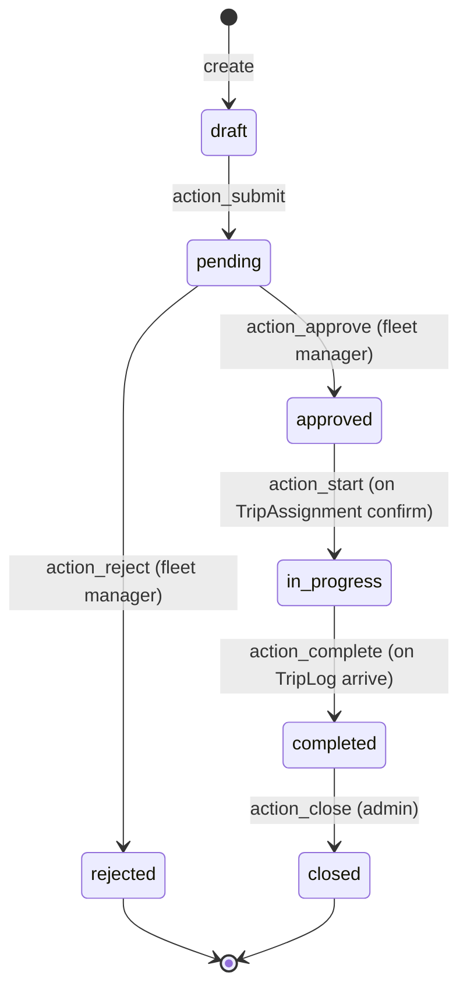

# Design Document: MESSOB Fleet Management System

## Overview

The `mesob_fleet_customizations` Odoo module extends the native `fleet` module to deliver a
comprehensive fleet management solution. It adds HR-sourced driver assignment, predictive
maintenance, fuel consumption analytics, a trip request/dispatch workflow, inventory asset
integration, automated alert scheduling, and a cost dashboard — all within Odoo 16/17.

The module follows Odoo's standard extension pattern: it inherits `fleet.vehicle` rather than
replacing it, adds new models for each domain concern, and wires them together through computed
fields, ORM constraints, scheduled actions, and view inheritance.

### Design Goals

- Preserve all native Fleet module functionality; extend via `_inherit` only.
- Keep each domain concern in its own model file for maintainability.
- Use Odoo's built-in activity, mail, and cron infrastructure rather than custom notification code.
- Enforce data integrity at the ORM layer (constraints, `ondelete` policies) so the database stays
  consistent regardless of which interface is used.

---

## Architecture

### Module Dependency Graph



### File Structure

```
mesob_fleet_customizations/
├── __init__.py
├── __manifest__.py
├── models/
│   ├── __init__.py
│   ├── fleet_vehicle.py          # _inherit fleet.vehicle — adds all custom fields
│   ├── service_record.py         # mesob.service.record
│   ├── fuel_log.py               # mesob.fuel.log
│   ├── odometer_log.py           # mesob.odometer.log
│   ├── maintenance_schedule.py   # mesob.maintenance.schedule
│   ├── maintenance_log.py        # mesob.maintenance.log
│   ├── inventory_allocation.py   # mesob.inventory.allocation
│   ├── trip_request.py           # mesob.trip.request  (state machine)
│   ├── trip_assignment.py        # mesob.trip.assignment
│   └── trip_log.py               # mesob.trip.log
├── views/
│   ├── menu.xml
│   ├── fleet_vehicle_views.xml   # inherits fleet.vehicle form/list/kanban
│   ├── service_record_views.xml
│   ├── fuel_log_views.xml
│   ├── odometer_log_views.xml
│   ├── trip_request_views.xml
│   ├── trip_assignment_views.xml
│   └── dashboard_views.xml
├── data/
│   └── cron.xml                  # ir.cron for Alert_Scheduler
└── security/
    ├── security.xml              # group definitions
    └── ir.model.access.csv       # per-model ACL rows
```

### Layer Diagram



---

## Components and Interfaces

### 1. FleetVehicle Extension (`fleet_vehicle.py`)

Inherits `fleet.vehicle`. Adds custom fields and hosts the Predictive Engine and HR integration
hooks.

**Key responsibilities:**
- Store `driver_id` (Many2one `hr.employee`), `availability`, `tax_expiry_date`,
  `contract_expiry_date`, `current_odometer`.
- Compute `predicted_next_service`, `predicted_remaining_km`, `maintenance_due`.
- Compute `fuel_consumption` (L/100 km) from related `mesob.fuel.log` records.
- React to `hr.employee` archive events to auto-unassign drivers.
- Enforce `license_plate` non-empty constraint.

**Public methods:**
- `_compute_maintenance_due()` — triggered by changes to `predicted_next_service`,
  `predicted_remaining_km`, `current_odometer`.
- `_compute_fuel_consumption()` — triggered by changes to related `mesob.fuel.log`.
- `_compute_predicted_fields()` — reads linked `mesob.maintenance.schedule` to derive
  `predicted_next_service` and `predicted_remaining_km`.
- `action_open_stock_moves()` — returns an action filtered to `stock.move` records for this vehicle.

### 2. ServiceRecord (`service_record.py`)

Standalone model `mesob.service.record`. Captures a single fuel or maintenance cost event.

**Key responsibilities:**
- Enforce non-negative `cost`.
- Use `ondelete='restrict'` on `vehicle_id` to prevent vehicle deletion while records exist.
- Provide aggregation surface for the Dashboard graph view.

### 3. FuelLog (`fuel_log.py`)

Model `mesob.fuel.log`. Each row is one fill-up event.

**Key responsibilities:**
- Store `volume` (litres) and `odometer` at fill-up.
- Trigger recomputation of `fuel_consumption` on the parent vehicle via `@api.model_create_multi`
  and `write`/`unlink` overrides that call `vehicle_id._compute_fuel_consumption()`.

### 4. OdometerLog (`odometer_log.py`)

Model `mesob.odometer.log`. Monotonically increasing odometer readings.

**Key responsibilities:**
- Enforce that new `value` ≥ current maximum for the same vehicle.
- On save, write `current_odometer` on the parent vehicle.

### 5. MaintenanceSchedule (`maintenance_schedule.py`)

Model `mesob.maintenance.schedule`. One record per vehicle defines the service interval.

**Key responsibilities:**
- Store `last_service_date`, `last_odometer`, `interval_km`, `interval_days`.
- Changes here trigger recomputation of `predicted_next_service` and `predicted_remaining_km`
  on the parent vehicle.

### 6. MaintenanceLog (`maintenance_log.py`)

Model `mesob.maintenance.log`. Audit trail of completed maintenance events.

### 7. InventoryAllocation (`inventory_allocation.py`)

Model `mesob.inventory.allocation`. Links a `product.product` to a `fleet.vehicle`.

**Key responsibilities:**
- `vehicle_id` uses `ondelete='set null'` so vehicle deletion does not cascade.
- Optionally links to a `stock.move` via `stock_move_id` (Many2one `stock.move`).

### 8. TripRequest (`trip_request.py`)

Model `mesob.trip.request`. Implements the full dispatch state machine.

**Key responsibilities:**
- Manage `status` transitions with guard conditions.
- Notify fleet manager on submission via `activity_schedule`.
- Prevent approval of requests whose `start_datetime` is in the past (warning, not error).
- Prevent assignment of unavailable vehicles.

### 9. TripAssignment (`trip_assignment.py`)

Model `mesob.trip.assignment`. Created when a Trip_Request is approved.

**Key responsibilities:**
- Link `request_id`, `vehicle_id`, `driver_id`, `assigned_by`.
- On confirmation, set `vehicle.availability = False` and transition request to `in_progress`.

### 10. TripLog (`trip_log.py`)

Model `mesob.trip.log`. Departure/arrival events for a Trip_Assignment.

**Key responsibilities:**
- On `arrive` entry, trigger `request_id.status = 'completed'` and
  `vehicle_id.availability = True`.

### 11. Alert Scheduler

An `ir.cron` record in `data/cron.xml` calls `fleet.vehicle._run_alert_scheduler()` daily.

**Key responsibilities:**
- For each active vehicle: check `maintenance_due`, `tax_expiry_date`, `contract_expiry_date`.
- Create `mail.activity` records only when no open activity with the same summary exists.
- Set `availability = False` when `maintenance_due` is True; restore when False.

---

## Data Models

### fleet.vehicle (extended)

| Field | Type | Notes |
|---|---|---|
| `driver_id` | Many2one `hr.employee` | No inline create; domain `[('active','=',True)]` |
| `availability` | Boolean | Default `True` |
| `assignment_date` | Date | |
| `tax_expiry_date` | Date | |
| `contract_expiry_date` | Date | |
| `current_odometer` | Integer | Updated by OdometerLog on save |
| `predicted_next_service` | Date | Computed, stored |
| `predicted_remaining_km` | Integer | Computed, stored |
| `maintenance_due` | Boolean | Computed, stored |
| `fuel_consumption` | Float | Computed, stored; L/100 km |
| `vin` | Char | Vehicle Identification Number |
| `location` | Char | Current parking location |
| `purchase_value` | Float | Monetary |
| `residual_value` | Float | Monetary |

**Constraints:**
- `license_plate` must be non-empty (`@api.constrains`).
- `driver_id` must reference an active employee (`@api.constrains`).

**Computed field dependencies:**

```
predicted_next_service  ← maintenance_schedule_ids.last_service_date,
                          maintenance_schedule_ids.interval_days
predicted_remaining_km  ← maintenance_schedule_ids.last_odometer,
                          maintenance_schedule_ids.interval_km,
                          current_odometer
maintenance_due         ← predicted_next_service, predicted_remaining_km
fuel_consumption        ← fuel_log_ids.volume, fuel_log_ids.odometer
```

### mesob.service.record

| Field | Type | Notes |
|---|---|---|
| `vehicle_id` | Many2one `fleet.vehicle` | Required; `ondelete='restrict'` |
| `service_type` | Selection `fuel\|maintenance` | Required |
| `date` | Date | Required |
| `cost` | Float (monetary) | Required; ≥ 0 |
| `currency_id` | Many2one `res.currency` | |
| `odometer` | Integer | Reading at time of service |
| `description` | Text | |

### mesob.fuel.log

| Field | Type | Notes |
|---|---|---|
| `vehicle_id` | Many2one `fleet.vehicle` | Required |
| `driver_id` | Many2one `hr.employee` | |
| `date` | Date | Required |
| `volume` | Float | Litres; > 0 |
| `cost` | Float | |
| `odometer` | Float | km at fill-up |
| `station` | Char | |

**Triggers:** `create`, `write`, `unlink` all call `vehicle_id._compute_fuel_consumption()`.

### mesob.odometer.log

| Field | Type | Notes |
|---|---|---|
| `vehicle_id` | Many2one `fleet.vehicle` | Required |
| `value` | Float | km; must be ≥ previous max |
| `date` | Date | Required |

**Constraint:** `value` ≥ max existing value for same vehicle.
**Side effect on save:** writes `vehicle_id.current_odometer = value`.

### mesob.maintenance.schedule

| Field | Type | Notes |
|---|---|---|
| `vehicle_id` | Many2one `fleet.vehicle` | Required; One2many inverse on vehicle |
| `last_service_date` | Date | |
| `last_odometer` | Float | km |
| `interval_km` | Float | km between services |
| `interval_days` | Integer | days between services |

### mesob.maintenance.log

| Field | Type | Notes |
|---|---|---|
| `vehicle_id` | Many2one `fleet.vehicle` | Required |
| `date` | Date | |
| `type` | Char | e.g. "Oil Change" |
| `description` | Text | |
| `cost` | Float | |
| `service_provider` | Char | |
| `next_due_odometer` | Float | km |

### mesob.inventory.allocation

| Field | Type | Notes |
|---|---|---|
| `vehicle_id` | Many2one `fleet.vehicle` | `ondelete='set null'` |
| `product_id` | Many2one `product.product` | Required |
| `quantity` | Float | |
| `stock_move_id` | Many2one `stock.move` | Optional link |
| `allocation_date` | Date | |

### mesob.trip.request

| Field | Type | Notes |
|---|---|---|
| `requester_id` | Many2one `res.users` | Default current user |
| `purpose` | Text | Required |
| `vehicle_category_needed` | Char | |
| `start_datetime` | Datetime | Required |
| `end_datetime` | Datetime | Required |
| `pickup_location` | Text | |
| `dest_location` | Text | |
| `status` | Selection | See state machine below |
| `rejection_reason` | Text | Populated on rejection |
| `assignment_ids` | One2many `mesob.trip.assignment` | |

**State machine:**



**Guards:**
- `action_approve`: warns if `start_datetime < now`.
- `action_start`: raises `ValidationError` if assigned vehicle `availability = False`.

### mesob.trip.assignment

| Field | Type | Notes |
|---|---|---|
| `request_id` | Many2one `mesob.trip.request` | Required |
| `vehicle_id` | Many2one `fleet.vehicle` | Required; must be available |
| `driver_id` | Many2one `hr.employee` | Required |
| `assigned_by` | Many2one `res.users` | Default current user |
| `assigned_at` | Datetime | Default now |

### mesob.trip.log

| Field | Type | Notes |
|---|---|---|
| `assignment_id` | Many2one `mesob.trip.assignment` | Required |
| `timestamp` | Datetime | Required |
| `status` | Selection `depart\|arrive` | Required |
| `odometer` | Float | km at event |
| `notes` | Text | |

---

## Computed Field Logic

### Predictive Engine

```python
@api.depends(
    'maintenance_schedule_ids.last_service_date',
    'maintenance_schedule_ids.interval_days',
    'maintenance_schedule_ids.last_odometer',
    'maintenance_schedule_ids.interval_km',
    'current_odometer',
)
def _compute_predicted_fields(self):
    for vehicle in self:
        schedule = vehicle.maintenance_schedule_ids[:1]
        if not schedule:
            vehicle.predicted_next_service = False
            vehicle.predicted_remaining_km = False
        else:
            if schedule.last_service_date and schedule.interval_days:
                vehicle.predicted_next_service = (
                    schedule.last_service_date
                    + timedelta(days=schedule.interval_days)
                )
            else:
                vehicle.predicted_next_service = False

            if schedule.interval_km and schedule.last_odometer is not False:
                vehicle.predicted_remaining_km = int(
                    (schedule.last_odometer + schedule.interval_km)
                    - vehicle.current_odometer
                )
            else:
                vehicle.predicted_remaining_km = False

@api.depends('predicted_next_service', 'predicted_remaining_km')
def _compute_maintenance_due(self):
    today = fields.Date.today()
    threshold = today + timedelta(days=7)
    for vehicle in self:
        due = False
        if vehicle.predicted_next_service and vehicle.predicted_next_service <= threshold:
            due = True
        if vehicle.predicted_remaining_km is not False and vehicle.predicted_remaining_km < 500:
            due = True
        vehicle.maintenance_due = due
```

### Fuel Consumption (L/100 km)

```python
@api.depends('fuel_log_ids.volume', 'fuel_log_ids.odometer')
def _compute_fuel_consumption(self):
    for vehicle in self:
        logs = vehicle.fuel_log_ids.filtered(lambda l: l.odometer > 0)
        if len(logs) < 2:
            vehicle.fuel_consumption = 0.0  # displayed as "Insufficient data" in view
            continue
        total_volume = sum(logs.mapped('volume'))
        min_odo = min(logs.mapped('odometer'))
        max_odo = max(logs.mapped('odometer'))
        distance = max_odo - min_odo
        vehicle.fuel_consumption = (total_volume / distance * 100) if distance > 0 else 0.0
```

### HR Auto-Unassign on Employee Archive

Override `hr.employee.write` (or use a `_onchange` / `write` hook on `fleet.vehicle`) to detect
when `active` is set to `False` and clear `driver_id`:

```python
# In fleet_vehicle.py or a separate hr_employee_extension.py
class HrEmployee(models.Model):
    _inherit = 'hr.employee'

    def write(self, vals):
        result = super().write(vals)
        if 'active' in vals and not vals['active']:
            vehicles = self.env['fleet.vehicle'].search(
                [('driver_id', 'in', self.ids)]
            )
            vehicles.write({'driver_id': False})
        return result
```

### Alert Scheduler Logic

```python
def _run_alert_scheduler(self):
    today = fields.Date.today()
    expiry_threshold = today + timedelta(days=30)
    maintenance_threshold = today + timedelta(days=7)
    activity_type = self.env.ref('mail.mail_activity_data_todo')

    for vehicle in self.search([('active', '=', True)]):
        # Maintenance due
        if vehicle.maintenance_due:
            vehicle.availability = False
            self._create_activity_if_absent(vehicle, "Maintenance Due", activity_type)
        else:
            vehicle.availability = True

        # Tax expiry
        if vehicle.tax_expiry_date and vehicle.tax_expiry_date <= expiry_threshold:
            self._create_activity_if_absent(vehicle, "Tax Expiry", activity_type)

        # Contract expiry
        if vehicle.contract_expiry_date and vehicle.contract_expiry_date <= expiry_threshold:
            self._create_activity_if_absent(vehicle, "Contract Expiry", activity_type)

def _create_activity_if_absent(self, vehicle, summary, activity_type):
    existing = self.env['mail.activity'].search([
        ('res_model', '=', 'fleet.vehicle'),
        ('res_id', '=', vehicle.id),
        ('summary', '=', summary),
    ], limit=1)
    if not existing:
        vehicle.activity_schedule(
            activity_type_id=activity_type.id,
            summary=summary,
            user_id=vehicle.manager_id.id or self.env.uid,
        )
```

---

## View Architecture

### Vehicle Views (`fleet_vehicle_views.xml`)

- **Form** (inherited): adds a "MESSOB Info" group with `driver_id`, `availability`,
  `tax_expiry_date`, `contract_expiry_date`, `predicted_next_service`, `predicted_remaining_km`,
  `maintenance_due`, `fuel_consumption`; adds tabs for Service Records, Fuel Logs, Odometer Logs,
  Maintenance Schedule, Inventory Allocations.
- **List** (inherited): adds columns `driver_id`, `availability`, `tax_expiry_date`.
  Decorates rows with `decoration-danger="not availability"`.
- **Kanban** (inherited): groups by `state_id` by default; shows `availability` badge.

### Service Record Views (`service_record_views.xml`)

- **List**: `vehicle_id`, `service_type`, `date`, `cost`. Group-by: `vehicle_id`, `service_type`.
- **Form**: all fields including `currency_id`, `description`.
- **Search**: filters by `vehicle_id`, `service_type`, date range.

### Trip Request Views (`trip_request_views.xml`)

- **Form**: `statusbar` widget on `status` field showing all states. Action buttons per state
  (`Submit`, `Approve`, `Reject`, `Start`, `Complete`, `Close`). `rejection_reason` visible only
  when `status = 'rejected'`.
- **List**: `requester_id`, `purpose`, `start_datetime`, `status`.

### Dashboard Views (`dashboard_views.xml`)

- **Graph 1** (bar, stacked): `mesob.service.record` — x-axis `date` (month), measure `cost`,
  colour by `service_type`.
- **Graph 2** (pie): `fleet.vehicle` — grouped by `state_id`, measure count.
- **Graph 3** (bar): `fleet.vehicle` — grouped by `tag_ids`, measure count.
- **Pivot**: `mesob.service.record` — rows `vehicle_id`, columns `service_type`, measure `cost`.
- Date-range filter via standard Odoo search panel `filter_date`.

### Menu Structure

```
MESSOB Fleet (root)
├── Vehicles
├── Service Records
├── Fuel Logs
├── Odometer Readings
├── Maintenance
│   ├── Schedules
│   └── Logs
├── Trips
│   ├── Trip Requests
│   └── Trip Assignments
├── Inventory Allocations
└── Dashboard
```

---

## Security Model

### Groups (`security/security.xml`)

| Group | XML ID | Description |
|---|---|---|
| Fleet Manager | `group_fleet_manager` | Full CRUD on all models; can approve trips |
| Fleet User | `group_fleet_user` | Create/read/write own records; cannot delete |
| Fleet Read-Only | `group_fleet_readonly` | Read-only on all models |

### Access Control (`ir.model.access.csv`)

Each custom model gets three rows (one per group). Representative rows:

```
id,name,model_id:id,group_id:id,perm_read,perm_write,perm_create,perm_unlink
access_service_record_manager,service_record_manager,model_mesob_service_record,group_fleet_manager,1,1,1,1
access_service_record_user,service_record_user,model_mesob_service_record,group_fleet_user,1,1,1,0
access_service_record_readonly,service_record_readonly,model_mesob_service_record,group_fleet_readonly,1,0,0,0
```

The same pattern applies to: `mesob.fuel.log`, `mesob.odometer.log`, `mesob.maintenance.schedule`,
`mesob.maintenance.log`, `mesob.inventory.allocation`, `mesob.trip.request`,
`mesob.trip.assignment`, `mesob.trip.log`.

Trip approval actions (`action_approve`, `action_reject`, `action_close`) are guarded by
`groups="mesob_fleet_customizations.group_fleet_manager"` in the view XML.

---

## Error Handling

| Scenario | Handling |
|---|---|
| Empty `license_plate` on save | `ValidationError("License plate is required.")` |
| `cost < 0` on ServiceRecord | `ValidationError("Cost cannot be negative.")` |
| Odometer value decreases | `ValidationError("Odometer value cannot be less than the previous reading.")` |
| Assigning archived employee as driver | `ValidationError` in `@api.constrains('driver_id')` |
| Assigning unavailable vehicle to trip | `ValidationError` in `action_start` |
| Vehicle deletion with existing ServiceRecords | Blocked by `ondelete='restrict'` (DB-level) |
| Vehicle deletion with InventoryAllocations | `vehicle_id` set to `False` (`ondelete='set null'`) |
| `start_datetime` in past at approval | `UserWarning` via `self.env.user.notify_warning()` (non-blocking) |
| Fuel consumption with < 2 logs | Returns `0.0`; view displays "Insufficient data" via `attrs` |
| Duplicate alert activity | Checked before creation; skipped if open activity with same summary exists |

---


## Correctness Properties

*A property is a characteristic or behavior that should hold true across all valid executions of a
system — essentially, a formal statement about what the system should do. Properties serve as the
bridge between human-readable specifications and machine-verifiable correctness guarantees.*

---

### Property 1: License Plate Required

*For any* attempt to save a `fleet.vehicle` record with an empty or whitespace-only `license_plate`,
the system should raise a `ValidationError` and the record should not be persisted.

**Validates: Requirements 1.2**

---

### Property 2: Employee Archive Auto-Unassigns Drivers

*For any* set of vehicles that share the same `driver_id`, archiving that `hr.employee` record
(setting `active = False`) should result in `driver_id = False` on every one of those vehicles.

**Validates: Requirements 2.2**

---

### Property 3: Archived Employee Cannot Be Assigned as Driver

*For any* `hr.employee` record where `active = False`, attempting to set that employee as the
`driver_id` on any vehicle should raise a `ValidationError`.

**Validates: Requirements 2.4**

---

### Property 4: Service Record Cost Non-Negative

*For any* `mesob.service.record` saved with a `cost` value strictly less than zero, the system
should raise a `ValidationError` and the record should not be persisted.

**Validates: Requirements 3.2**

---

### Property 5: Vehicle Deletion Blocked by Service Records

*For any* `fleet.vehicle` that has at least one associated `mesob.service.record`, attempting to
delete that vehicle should raise an error (ORM `ondelete='restrict'`) and the vehicle record should
remain in the database.

**Validates: Requirements 3.6**

---

### Property 6: Odometer Readings Are Monotonically Non-Decreasing

*For any* vehicle and any new `mesob.odometer.log` entry whose `value` is strictly less than the
maximum existing `value` for that vehicle, the system should raise a `ValidationError` and the
record should not be persisted.

**Validates: Requirements 4.2**

---

### Property 7: Odometer Log Updates Vehicle's current_odometer

*For any* vehicle, saving a new `mesob.odometer.log` with value `v` should result in
`vehicle.current_odometer == v` immediately after the save.

**Validates: Requirements 4.3, 4.5**

---

### Property 8: Predictive Engine — Next Service Date Formula

*For any* vehicle with a linked `mesob.maintenance.schedule` where `last_service_date` and
`interval_days` are set, `vehicle.predicted_next_service` should equal
`last_service_date + timedelta(days=interval_days)`.

**Validates: Requirements 5.1**

---

### Property 9: Predictive Engine — Remaining KM Formula

*For any* vehicle with a linked `mesob.maintenance.schedule` where `last_odometer` and `interval_km`
are set, `vehicle.predicted_remaining_km` should equal
`(last_odometer + interval_km) - current_odometer`.

**Validates: Requirements 5.2**

---

### Property 10: Maintenance Due Conditions

*For any* vehicle, `maintenance_due` should be `True` if and only if at least one of the following
holds: (a) `predicted_next_service` is within 7 calendar days of today, or (b)
`predicted_remaining_km` is less than 500. When neither condition holds, `maintenance_due` should
be `False`.

**Validates: Requirements 5.3, 5.4**

---

### Property 11: Alert Scheduler Creates Activities for Due Conditions

*For any* active vehicle where a due condition is met (maintenance due, tax expiry within 30 days,
or contract expiry within 30 days) and no open `mail.activity` with the corresponding summary
already exists, calling `_run_alert_scheduler()` should result in exactly one new activity being
created on that vehicle with the correct summary.

**Validates: Requirements 6.2, 6.3, 6.4**

---

### Property 12: Alert Scheduler Is Idempotent (No Duplicate Activities)

*For any* vehicle that already has an open `mail.activity` with a given summary (e.g. "Maintenance
Due"), calling `_run_alert_scheduler()` again should not create a second activity with the same
summary — the count of open activities with that summary should remain exactly one.

**Validates: Requirements 6.6**

---

### Property 13: Availability Syncs with Maintenance Due

*For any* vehicle, after `_run_alert_scheduler()` runs: if `maintenance_due = True` then
`availability = False`; if `maintenance_due = False` then `availability = True`. This round-trip
holds regardless of the vehicle's prior availability state.

**Validates: Requirements 6.5, 6.7**

---

### Property 14: Vehicle Deletion Nullifies Inventory Allocation References

*For any* `mesob.inventory.allocation` record linked to a vehicle, deleting that vehicle should
set `allocation.vehicle_id = False` (not delete the allocation record). The allocation record
should still exist in the database after the vehicle is deleted.

**Validates: Requirements 8.3**

---

### Property 15: Fuel Consumption Formula Correctness

*For any* vehicle with at least 2 `mesob.fuel.log` records where the maximum and minimum `odometer`
values differ (i.e. `total_distance > 0`), `vehicle.fuel_consumption` should equal
`sum(volume) / (max(odometer) - min(odometer)) * 100`, and the result should be strictly greater
than zero.

**Validates: Requirements 9.1, 9.5**

---

### Property 16: Trip Request State Machine Transitions Are Valid

*For any* `mesob.trip.request`, the following transition sequence should hold:
`draft → pending` (via `action_submit`), `pending → approved` (via `action_approve`) or
`pending → rejected` (via `action_reject`), `approved → in_progress` (via `action_start`),
`in_progress → completed` (via arrival `TripLog`), `completed → closed` (via `action_close`).
No transition should be possible that skips a state or moves backwards. A closed record should
reject any further state-changing action.

**Validates: Requirements 11.2, 11.3, 11.4, 11.5, 11.6, 11.7**

---

### Property 17: Unavailable Vehicle Cannot Be Assigned to a Trip

*For any* `fleet.vehicle` where `availability = False`, attempting to confirm a
`mesob.trip.assignment` referencing that vehicle should raise a `ValidationError` and the
assignment should not be confirmed.

**Validates: Requirements 11.9**

---

## Testing Strategy

### Dual Testing Approach

Both unit tests and property-based tests are required. They are complementary:

- **Unit tests** cover specific examples, integration points, and edge cases (e.g. the exact
  "Insufficient data" display when fewer than 2 fuel logs exist, or the warning shown when
  `start_datetime` is in the past).
- **Property-based tests** verify universal correctness across randomly generated inputs, covering
  all 17 properties above.

### Property-Based Testing Library

Use **Hypothesis** (Python) — the standard PBT library for Python/Odoo environments.

```bash
pip install hypothesis
```

Each property test must run a minimum of **100 iterations** (Hypothesis default is 100; increase
with `@settings(max_examples=200)` for critical properties).

### Property Test Tag Format

Every property test must include a comment referencing the design property:

```python
# Feature: mesob-fleet-management, Property 10: maintenance_due conditions
@given(...)
@settings(max_examples=100)
def test_maintenance_due_conditions(vehicle, schedule):
    ...
```

### Unit Test Focus Areas

- Specific field values after model creation (structural examples for requirements 1.1, 3.1, 4.1).
- Edge case: `fuel_consumption` with exactly 1 fuel log → displays "Insufficient data".
- Edge case: vehicle with no `MaintenanceSchedule` → all predicted fields are `False`.
- Edge case: `start_datetime` in the past at approval → warning is issued, not an error.
- Integration: `InventoryAllocation` created from within a `stock.picking`.
- Integration: `stock.move` form view shows "Fleet Asset" field when `stock` module is installed.

### Property Test Generators

Key Hypothesis strategies needed:

```python
from hypothesis import given, settings, strategies as st
from hypothesis.extra.django import from_model  # or custom Odoo record factories

# Vehicle with random license plate (non-empty)
valid_license_plate = st.text(min_size=1).filter(lambda s: s.strip())

# Odometer sequence (monotonically increasing)
odometer_sequence = st.lists(
    st.floats(min_value=0, max_value=1_000_000),
    min_size=2
).map(sorted)

# Fuel log volumes and odometers
fuel_log_data = st.lists(
    st.tuples(
        st.floats(min_value=0.1, max_value=200),   # volume
        st.floats(min_value=0, max_value=500_000),  # odometer
    ),
    min_size=2
)
```

### Coverage Mapping

| Property | Test Type | Hypothesis Strategy |
|---|---|---|
| P1 License plate required | property | `st.text()` including empty/whitespace |
| P2 Employee archive unassigns | property | random employee + vehicle set |
| P3 Archived employee rejected | property | archived employee records |
| P4 Negative cost rejected | property | `st.floats(max_value=-0.01)` |
| P5 Vehicle deletion blocked | property | vehicle + service record pairs |
| P6 Odometer monotonic | property | decreasing float pairs |
| P7 Odometer updates vehicle | property | random odometer values |
| P8 Next service date formula | property | random dates + intervals |
| P9 Remaining km formula | property | random odometer + interval values |
| P10 Maintenance due conditions | property | random date/km combinations |
| P11 Scheduler creates activities | property | vehicles with due conditions |
| P12 Scheduler idempotent | property | vehicles with existing activities |
| P13 Availability syncs | property | random maintenance_due states |
| P14 Allocation null on delete | property | vehicle + allocation pairs |
| P15 Fuel consumption formula | property | `fuel_log_data` strategy |
| P16 State machine transitions | property | random trip request states |
| P17 Unavailable vehicle rejected | property | unavailable vehicle + assignment |
